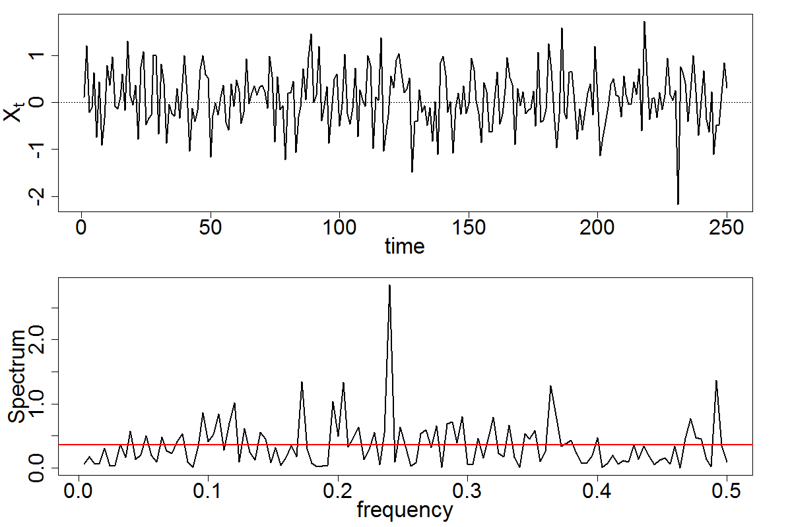

[](http://quantlet.de/index.php?p=info)

## [](http://quantlet.de/) **SFESpecWN**[](http://quantlet.de/d3/ia)

```yaml
Name of QuantLet: SFESpecWN

Published in: Statistics of Financial Markets

Description: 'Computes the spectrum (frequency domain representation) of a white noise process'

Keywords: time series, spectrum, simulation, signal, plot, spectral analysis, White Noise

See also: SFEPer, SFEFreqFilt, SFESpecSim, SFESpecSignal, SFETsDecomp

Author: Franziska Schulz, Elisabeth Bommes, Caroline Kleist

Submitted: Mon, May 09 2016 by Christoph Schult

Output: Spectrum of white noise process.

```



```r
# set graphical parameters
par(mfrow = c(2, 1), mar = c(4, 4.5, 1, 3) + 0.1, mgp = c(2.5, 1, 0))

# create sample for a random variable from normal distribution
x = rnorm(250, 0, 0.6)

# plot sample
plot(x, type = "l", xlab = "time", ylab = expression(X[t]), lwd = 2, cex.lab = 2.1, cex.axis = 2)
abline(h = 0, lty = 3)
# plot the spectral density
spec.pgram(x, log = "no", xlab = "frequency", main = "", lwd = 2,
           cex.lab = 2.1, cex.axis = 2, sub = "", ylab = "Spectrum")
abline(h = 0.6^2, col = 2, lwd = 2)
```
