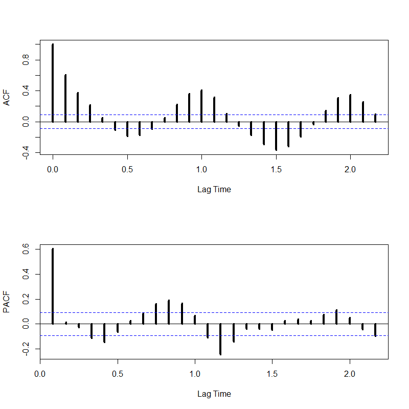
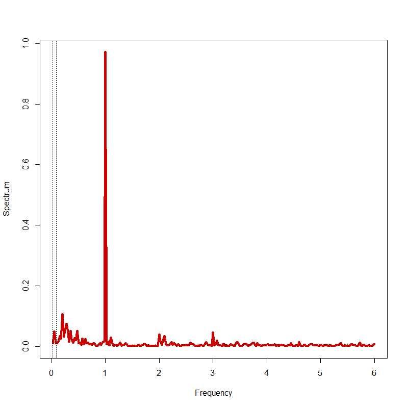
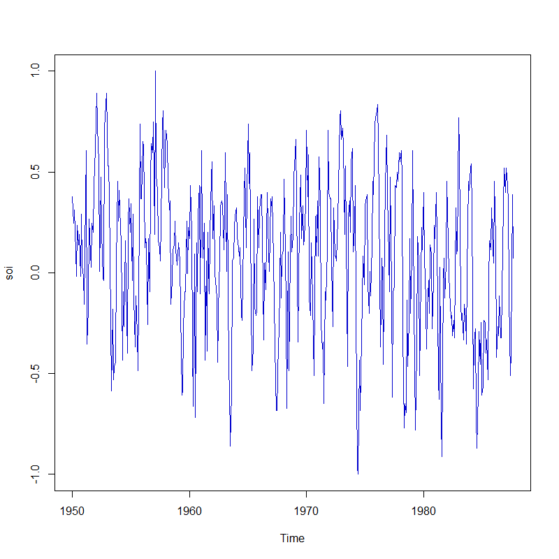

[](http://quantlet.de/index.php?p=info)

## [](http://quantlet.de/) **SFEPer**[](http://quantlet.de/d3/ia)

```yaml
Name of QuantLet: SFEPer

Published in: Statistics of Financial Markets

Description: 'Computes time series plots for the time domain and the frequency domain, i.e. the periodogram'

Keywords: time series, spectrum, filter, frequency, plot, spectral analysis, periodogram, acf, pacf

See also: SFESignal, SFEFreqFilt, SFESpecSim, SFESpecWN, SFETsDecomp

Author: Dedy D. Prastyo, Elisabeth Bommes, Caroline Kleist

Submitted: Mon, May 09 2016 by Christoph Schult

Input: Data for the Southern Oscillation Index from the package astsa.

Output: 'Two plots for the acf and pacf of the Southern Oscillation Index. Furthermore one plot for the time and one for the frequency domain of the SOI.'

```





```r
# install and load packages
libraries = c("astsa")
lapply(libraries, function(x) if (!(x %in% installed.packages())) {
  install.packages(x)
})
lapply(libraries, library, quietly = TRUE, character.only = TRUE)

# attach data
data(soi)

# Time domain
par(mfrow=c(1, 1))
plot(soi, type="l", col ="blue3")

par(mfrow=c(2,1))
acf(soi,  xlab = "Lag Time", lwd = 4, main = "")
pacf(soi, xlab = "Lag Time", ylab = "PACF", lwd = 4, main = "")

# Frequency domain
par(mfrow = c(1, 1))
soi.per = spec.pgram(soi, taper = 0, log = "no", col = "red3", lwd = 4, main = "", sub = "",
                     ylab = "Spectrum", xlab = "Frequency")
abline(v = 1/12, lty = "dotted")
abline(v = 1/48, lty = "dotted")
```
