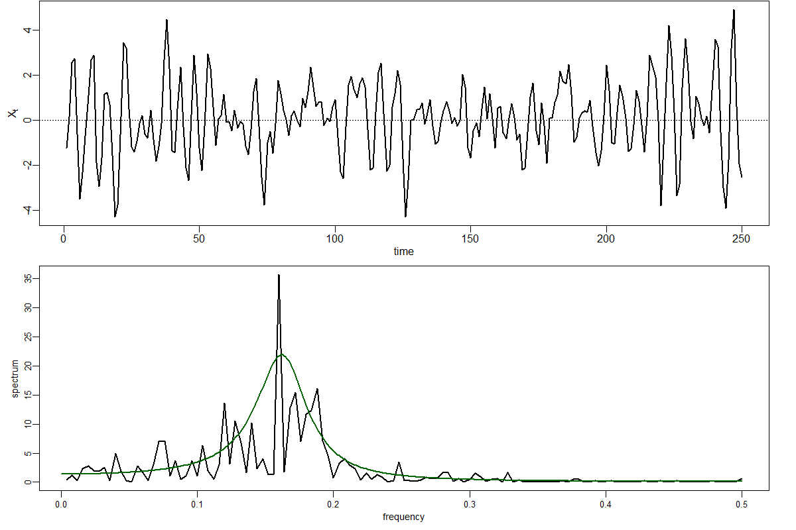
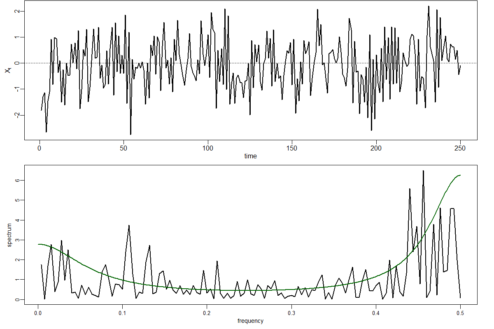
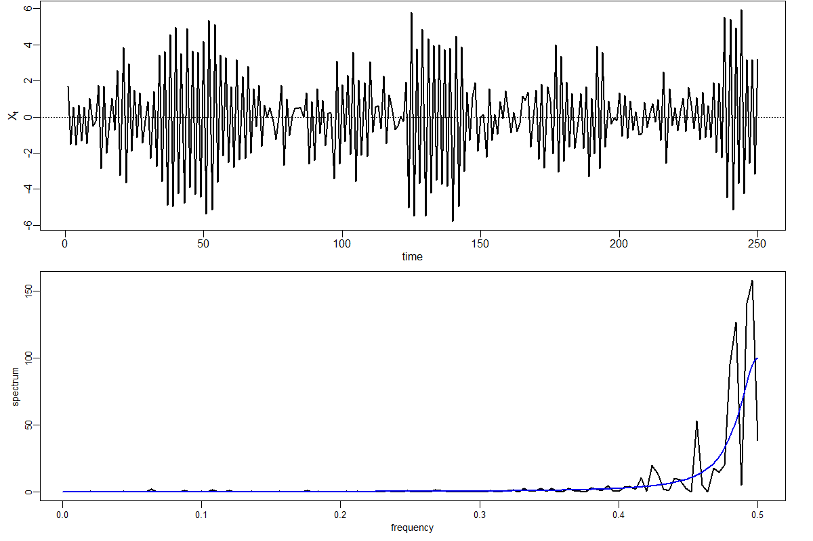
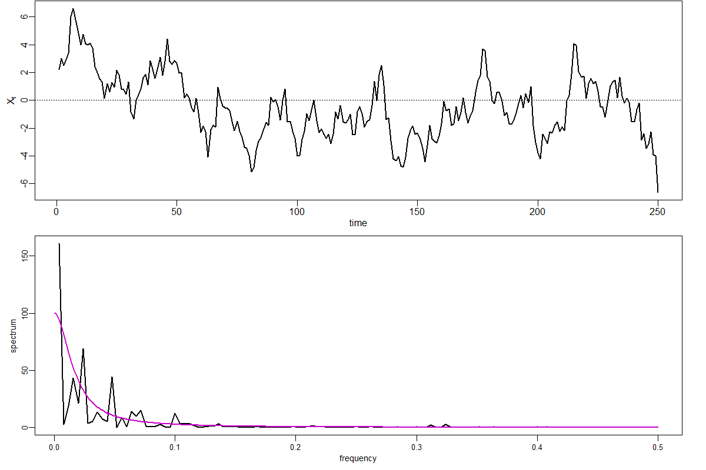
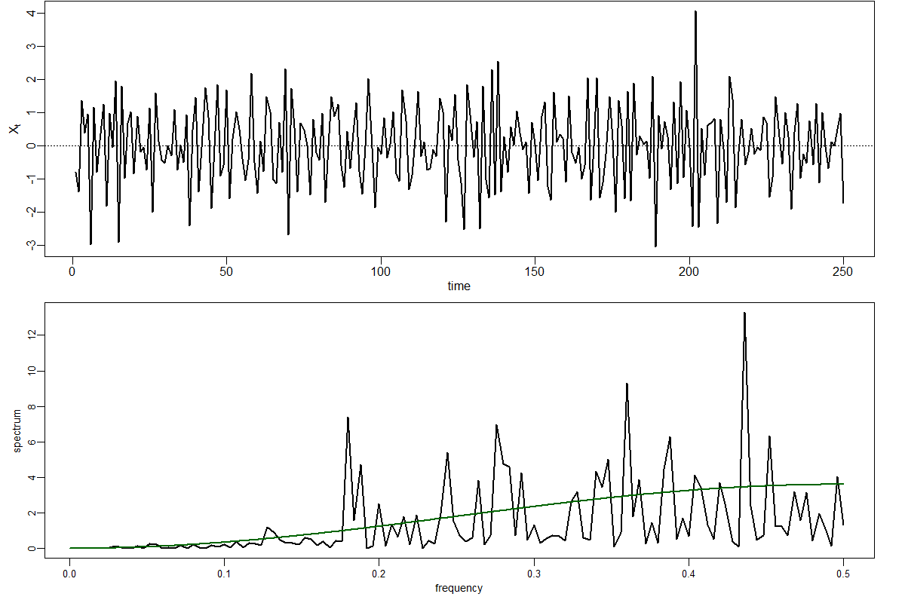
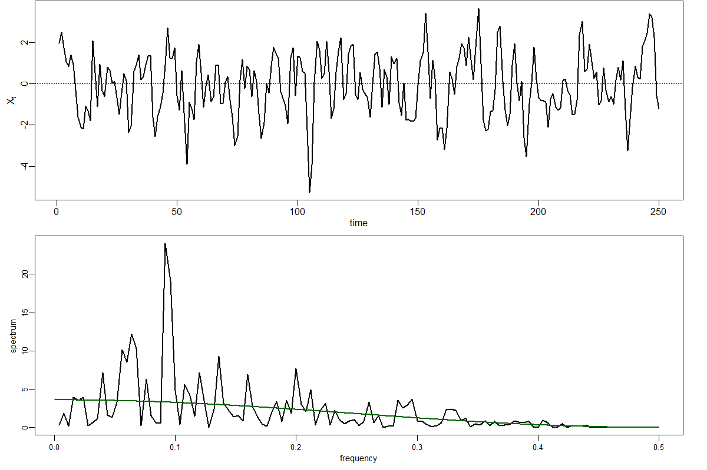
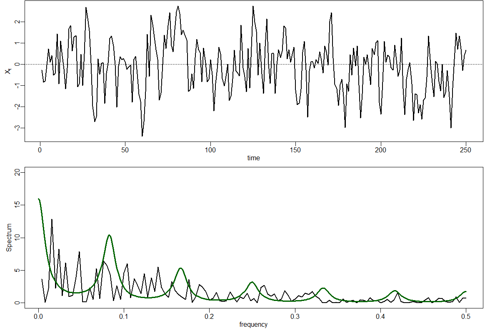

[](http://quantlet.de/index.php?p=info)

## [](http://quantlet.de/) **SFESpecSim**[](http://quantlet.de/d3/ia)

```yaml
Name of QuantLet: SFESpecSim

Published in: Statistics of Financial Markets

Description: 'SFESpecSim simulates AR(1), AR(2), MA(1), SAR(1) processes
and computes the theoretical spectral densities'

Keywords: time series, spectrum, simulation, plots, spectral, ar, ma, sar

See also: SFEPer, SFEFreqFilt, SFESignal, SFESpecWN, SFETsDecomp

Author: Elisabeth Bommes, Caroline Kleist

Submitted: Mon, May 09 2016 by Christoph Schult

Output: Spectral density graphs.

```









```r
# install and load packages
libraries = c("TSA")
lapply(libraries, function(x) if (!(x %in% installed.packages())) {
  install.packages(x)
})
lapply(libraries, library, quietly = TRUE, character.only = TRUE)

par(mfrow = c(2, 1), mar = c(3, 3, 0, 2) + 0.1, mgp = c(1.5, 0.5, 0))

n      =   250   # number of simulated values
theta1 =   0.9   # parameter of MA(1)
sigma  =   1     # variance of error term

Fr     = 0:50 / 100

# AR(1) processes
phi1 = 0.9   # parameter of AR(1)
x    = arima.sim(n = n, model = list(ar = phi1), rand.gen = function(n, ...) rnorm(n, 0, sigma)) # simulate process
l    = ARMAspec(model = list(ar = c(phi1)), plot = F) # compute theoretical spectral density

plot(x, type = "l", xlab = "time", ylab = expression(X[t]), lwd = 2, cex.axis = 0.8, cex.lab = 0.9)
abline(h = 0, lty = "dotted")
spec.pgram(x, log = "no", xlab = "frequency", ylab = "spectrum", main = "", sub = "", lwd = 2, cex.axis = 0.8, cex.lab = 0.9)
lines(l$spec ~ l$freq, type = "l", lwd = 2, col = "magenta3")

phi1 = -0.9   # parameter of AR(1)
x    = arima.sim(n = n, model = list(ar = phi1), rand.gen = function(n, ...) rnorm(n, 0, sigma)) # simulate process
l    = ARMAspec(model = list(ar = c(phi1)), plot = F) # compute theoretical spectral density

plot(x, type = "l", xlab = "time", ylab = expression(X[t]), lwd = 2, cex.axis = 0.8, cex.lab = 0.9)
abline(h = 0, lty = "dotted")
spec.pgram(x, log = "no",xlab = "frequency", ylab = "spectrum", main = "", sub = "", lwd = 2, cex.axis = 0.8, cex.lab = 0.9)
lines(l$spec ~ l$freq, type = "l", lwd = 2, col = "blue2")


# AR(2) processes
phi1 = 0.9
phi2 = -0.75 # AR(2) parameters
x    = arima.sim(n = n,model = list(ar = c(phi1, phi2)), rand.gen = function(n, ...) rnorm(n, 0, sigma)) # simulate process
l    = ARMAspec(model = list(ar = c(phi1, phi2)), plot = FALSE) # compute theoretical spectral density

plot(x, type = "l", xlab = "time", ylab = expression(X[t]), lwd = 2, cex.axis = 0.8, cex.lab = 0.9)
abline(h = 0, lty = "dotted")
spec.pgram(x, log = "no",xlab = "frequency", ylab = "spectrum", main = "", sub = "", lwd = 2, cex.axis = 0.8, cex.lab = 0.9)
lines(l$spec ~ l$freq, type = "l", lwd = 2, col = "darkgreen")


phi1 = -0.1 ; phi2 = 0.5 # AR(2) parameters
x    = arima.sim(n = n,model = list(ar = c(phi1, phi2)), rand.gen = function(n, ...) rnorm(n, 0, sigma)) # simulate process
l    = ARMAspec(model = list(ar = c(phi1, phi2)), plot = FALSE) # compute theoretical spectral density

plot(x, type = "l", xlab = "time", ylab = expression(X[t]), lwd=2,cex.axis=0.8, cex.lab=0.9)
abline(h = 0, lty = "dotted")
spec.pgram(x, log = "no",xlab = "frequency", ylab = "spectrum", main="", sub="", lwd=2, cex.axis=0.8, cex.lab=0.9)
lines(l$spec ~ l$freq, type="l", lwd=2, col="darkgreen")


# MA(1) processes
theta1 = 0.9   # parameter of MA(1)
x    = arima.sim(n = n,model = list(ma = theta1), rand.gen = function(n, ...) rnorm(n, 0, sigma)) # simulate process
l    = ARMAspec(model = list(ma = c(theta1)), plot = FALSE) # compute theoretical spectral density

plot(x, type = "l", xlab = "time", ylab = expression(X[t]), lwd = 2, cex.axis = 0.8, cex.lab = 0.9)
abline(h = 0, lty = "dotted")
spec.pgram(x, log = "no", xlab = "frequency", ylab = "spectrum", main = "", sub = "", lwd = 2, cex.axis = 0.8, cex.lab = 0.9)
lines(l$spec ~ l$freq, type = "l", lwd = 2, col = "darkgreen")

theta1 = -0.9   # parameter of MA(1)
x    = arima.sim(n = n, model = list(ma = theta1), rand.gen = function(n, ...) rnorm(n, 0, sigma)) # simulate process
l    = ARMAspec(model = list(ma = c(theta1)), plot = FALSE) # compute theoretical spectral density

plot(x, type = "l", xlab = "time", ylab = expression(X[t]), lwd = 2, cex.axis = 0.8, cex.lab = 0.9)
abline(h = 0, lty = "dotted")
spec.pgram(x, log = "no", xlab = "frequency", ylab = "spectrum", main = "", sub = "", lwd = 2, cex.axis = 0.8, cex.lab = 0.9)
lines(l$spec ~ l$freq, type = "l", lwd = 2, col = "darkgreen")

# SAR(1) process

phi1   = 0.5
PHI1   = 0.5    # Reset theta for Seasonal AR
l      = ARMAspec(model=list(ar = phi1, seasonal = list(sar = PHI1, period = 12)), col = "magenta3", lwd = 3, cex.axis = 0.8, cex.lab = 0.9, plot = FALSE)
x      = arima.sim(n = n,model = list(ar = phi1, seasonal = list(sar = PHI1, period = 12)), rand.gen=function(n, ...) rnorm(n, 0, sigma))

plot(x, type = "l", xlab = "time", ylab = expression(X[t]), lwd = 2)
abline(h = 0, lty = "dotted")

spec.pgram(x, log = "no", xlab = "frequency", ylab = "Spectrum", main = "", lwd = 2, sub = "", ylim = c(0, 20))
lines(l$spec ~ l$freq, type = "l", lwd = 3, col = "darkgreen")
```
