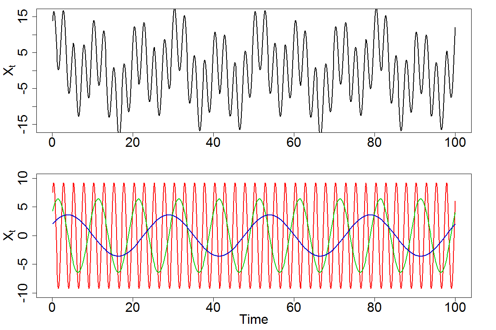

[](http://quantlet.de/index.php?p=info)

## [](http://quantlet.de/) **SFETsDecomp**[](http://quantlet.de/d3/ia)

```yaml
Name of QuantLet: SFETsDecomp

Published in: Statistics of Financial Markets

Description: 'SFETsDecomp computes plots showing the decomposition of a time series into sinosoids with frequencies f={0.4, 0.1, 0.04}'

Keywords: time series, spectrum, simulation, signal, plot, spectral analysis, time series decomposition, sinosoids

See also: SFEPer, SFEFreqFilt, SFESpecSim, SFESpecWN, SFETsDecomp

Author: Franziska Schulz, Elisabeth Bommes, Caroline Kleist

Submitted: Mon, May 09 2016 by Christoph Schult

Output: Decomposed time series into sinosoids.

```



```r
# set graphical parameters
par(mfrow = c(2, 1), mar = c(4, 4.5, 1, 3) + 0.1, mgp = c(2.5, 1, 0))

# create different time series
t = (1:1000) / 10
x1 = 2 * cos(2 * pi * t * 4 / 100) + 3 * sin(2 * pi * t * 4 / 100)
x2 = 4 * cos(2 * pi * t * 10 / 100) + 5 * sin(2 * pi * t * 10 / 100)
x3 = 6 * cos(2 * pi * t * 40 / 100) + 7 * sin(2 * pi * t * 40 / 100)
x  = x1 + x2 + x3

# plot decomposed time series
plot(t, x, ylab = expression(X[t]), xlab = "", cex.axis = 2,
     cex.lab = 2, type = "l", lwd = 2, ylim = c(-16, 16))

plot(t, x3, ylab = expression(X[t]), xlab = "Time", cex.axis = 2,
     cex.lab = 2, type = "l", col = "red", lwd = 2, ylim = c(-10, 10))
lines(t, x2, col = "green3", lwd = 2)
lines(t, x1, col = "blue3", lwd = 2)
```
