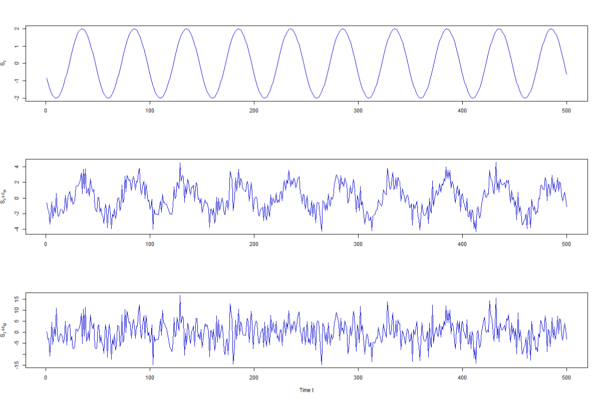

[](http://quantlet.de/index.php?p=info)

## [](http://quantlet.de/) **SFESignal**[](http://quantlet.de/d3/ia)

```yaml
Name of QuantLet: SFESignal

Published in: Statistics of Financial Markets

Description: 'Simulates signal S_t = 2 * cos {2 * pi * (t / 50) + 0.6 * pi}, 
with εt1 ~ N(0,1) and εt2 ~ N(0,25) and plots the results'

Keywords: time series, spectrum, simulation, signal, plot, spectral analysis

See also: SFEPer, SFEFreqFilt, SFESpecSim, SFESpecWN, SFETsDecomp

Author: Dedy D. Prastyo, Elisabeth Bommes, Caroline Kleist

Submitted: Mon, May 09 2016 by Christoph Schult

Output: Line plots for the simulated processes.

```



```r
# create simulated time series processes
t        = 1:500
S        = 2 * cos(2 * pi * t / 50 + .6 * pi)
epsilon1 = rnorm(500, 0, 1)
epsilon2 = 5 * epsilon1

# plot the simulated time series processes
par(mfrow = c(3, 1), mex = 1, lheight = 1.5)
plot.ts(S, xlab = "", col = "blue3", ylab = bquote(S[t]))
plot.ts(S + epsilon1, xlab = "", col = "blue3", ylab = bquote(S[t] +  εt1))
plot.ts(S + epsilon2, xlab = "Time t", col = "blue3", ylab = bquote(S[t] +  εt1))
```
